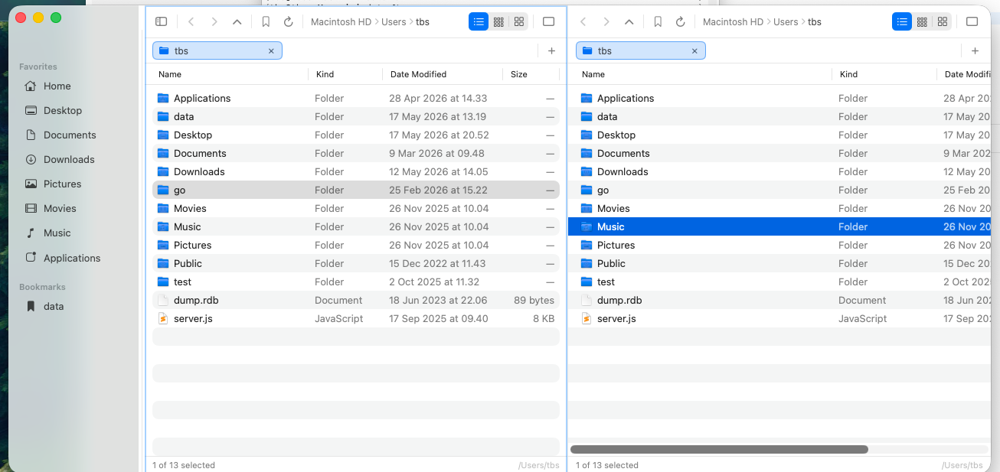

# FilePathX

A native macOS file manager, ported from an old Windows C/OpenGL file manager.
Tab-driven, keyboard-friendly, with a dual-pane mode for moving files around.



## What it does

- **Tabs** — each one keeps its own history, view mode, and selection.
- **Dual pane** (`⌘\`) — drag files between panels to copy, hold `⌘` to move.
- **Three view modes** — details table, small icons, large icons. Images and PDFs get real thumbnails (QuickLook).
- **Inline batch rename** — select 2+ files, hit `⌘E`. Type to append, backspace to chop characters off, Return to commit.
- **Real drag-out** — drop a file into Sublime, Safari, Terminal, etc. and the receiver gets the actual file path (not a `~/Library/Caches/...` copy).
- **Remembers itself** — view mode and sort per folder, plus the tabs and panels you had open last time.

## Shortcuts

| Key | Action |
|---|---|
| `Return` · `⌘↓` | Open file / enter folder |
| `Backspace` · `⌘↑` | Go to parent folder |
| `⌘E` · `F2` | Rename (batch if more than one selected) |
| `⌘C` / `⌘X` / `⌘V` | Copy / Cut / Paste |
| `⌘T` / `⌘W` | New / close tab |
| `⌃Tab` / `⌃⇧Tab` | Next / previous tab |
| `⌘[` / `⌘]` | Back / Forward |
| `⌘\` | Toggle split view |
| `Tab` | Switch panel (when split) |
| `⌃D` | Open Terminal at current folder |
| `⌘⇧N` | New folder |
| Arrows | Move selection |
| `⇧`+Arrows | Extend selection |
| `Esc` | Cancel rename |

## Build

Needs Xcode 15+. Runs on macOS 13+.

```bash
git clone https://github.com/goldalworming/filepathx-macos.git
cd filepathx-macos
open FilePathX.xcodeproj
```

`⌘R` in Xcode, or build a release `.app` from the command line:

```bash
xcodebuild -project FilePathX.xcodeproj -scheme FilePathX \
           -configuration Release -derivedDataPath build build
```

The app ends up at `build/Build/Products/Release/FilePathX.app`. It's signed
ad-hoc — fine to run on your own machine, but you'll need a real Developer ID
to distribute it.

## License

MIT.
